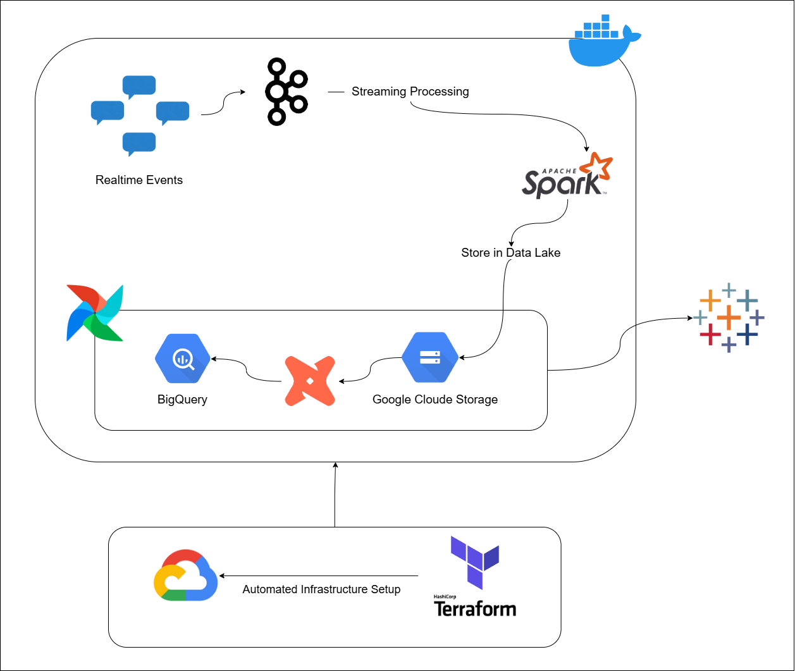
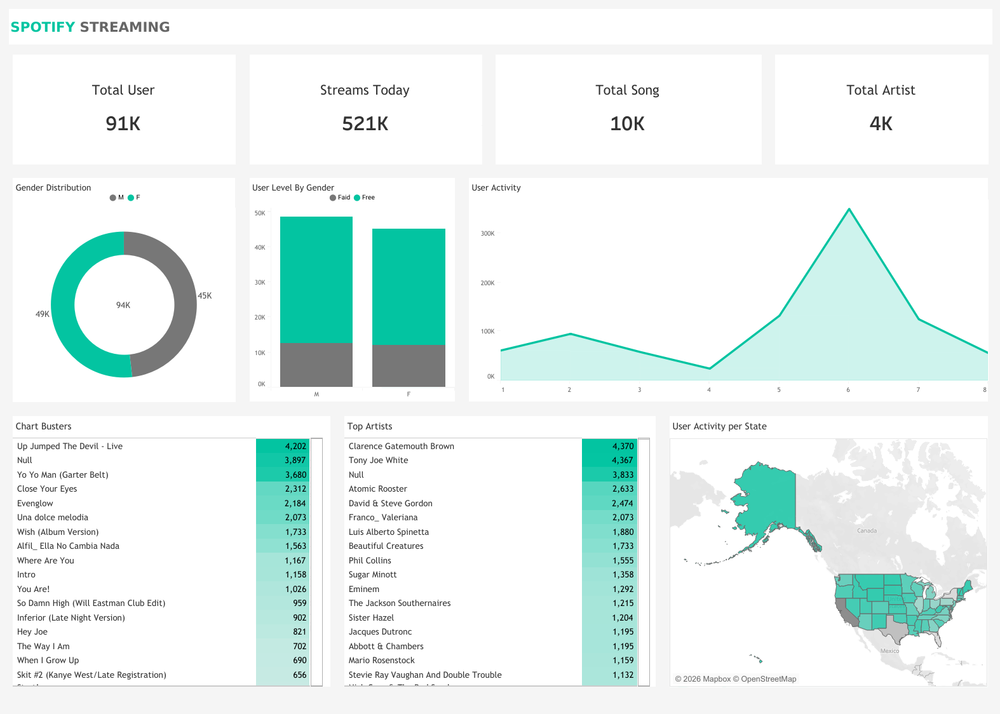

# 🎧 Streamify Modern Data Streaming Project

---

## 🏗️ Architecture

**Pipeline Flow:**

1. **Data Simulator** → Generates fake music streaming events (song play, navigation, login, device, region, demographics).
2. **Kafka Producer** → Streams real-time events into Kafka topics.
3. **Spark Streaming** → Consumes Kafka events and processes them in real-time.
4. **Data Lake (Google Cloud Storage)** → Processed streaming data is stored periodically (every 2 minutes) into GCS as raw data.
5. **Airflow** → Runs hourly batch jobs to: **Read data from GCS → Load it into BigQuery → Trigger transformation workflows**.
6. **BigQuery (Data Warehouse)** → Stores structured data tables for analytics.
7. **dbt** → Applies transformations and builds analytics-ready tables (fact & dimension models).
8. **Tableau** → Connects to final tables in BigQuery to visualize:

- 🎵 Most popular songs
- 👥 Active users
- 🌍 User demographics
- 📱 Device usage
- 📈 Streaming trends

---

## ⚡ Tools & Technologies

- Cloud - [**Google Cloud Platform**](https://cloud.google.com)
- Infrastructure as Code software - [**Terraform**](https://www.terraform.io)
- Containerization - [**Docker**](https://www.docker.com), [**Docker Compose**](https://docs.docker.com/compose/)
- Stream Processing - [**Kafka**](https://kafka.apache.org), [**Spark Streaming**](https://spark.apache.org/docs/latest/streaming-programming-guide.html)
- Orchestration - [**Airflow**](https://airflow.apache.org)
- Transformation - [**dbt**](https://www.getdbt.com)
- Data Lake - [**Google Cloud Storage**](https://cloud.google.com/storage)
- Data Warehouse - [**BigQuery**](https://cloud.google.com/bigquery)
- Data Visualization - [**Data Studio**](https://datastudio.google.com/overview)
- Language - [**Python**](https://www.python.org)

---

## ⚙️ Step-by-Step Implementation

### 1. Google Cloud Setup

- Create GCS Service Account for authentication.
- Generate google_credentials.json and set environment variable:
  `$env:GOOGLE_APPLICATION_CREDENTIALS="path/to/google_credentials.json"`
- Assign required IAM roles:
  ✅ BigQuery Admin
  ✅ Storage Admin
  ✅ Compute Admin
  ✅ Dataproc Administrator
  ✅ Service Account User
  - Enable required APIs:
  - IAM API
  - Compute Engine API
  - Dataproc API

### 2.Infrastructure Provisioning (Terraform)

Infrastructure is provisioned automatically using Terraform:

Resources created:

- Kafka VM Instance
- Airflow VM Instance
- Dataproc Spark Cluster
- Google Cloud Storage Bucket (Data Lake)
- BigQuery Datasets:
  - streamify_stg
  - streamify_prod
- Firewall rule opening port 9092 for Kafka communication.

Run :

- `terraform init`
- `terraform plan`
- `terraform apply`

## 3. Fake Data Generation (EventSim)

- Dockerized EventSim generates fake Spotify-like events:

Events :

- listen_events
- page_view_events
- auth_events

Each event simulates:

- song listening
- page navigation
- user authentication

### 4. Kafka Streaming Setup

Kafka runs inside Docker Compose on the Kafka VM.

Components:

- Zookeeper
- Kafka Broker
- Schema Registry
- Control Center UI

  Steps:

- `docker-compose up -d`

EventSim produces real-time messages into Kafka topics.

### 5. Spark Streaming (Real-time Processing)

Spark runs on Dataproc cluster.

Responsibilities:

- Consume Kafka topics.
- Apply schema and transformation.
- Partition data by time (year/month/day/hour).
- Store processed data into GCS Data Lake every 2 minutes.

Output :
**Parquet files in Google Cloud Storage**
Execution:
**spark-submit stream_all_events.py**

### 6. Data Lake (Google Cloud Storage)

Spark writes streaming outputs into:

- `gs://bucket-name/listen_events/`
- `gs://bucket-name/page_view_events/`
- `gs://bucket-name/page_view_events/`

Features:

- Partitioned storage
- Checkpointing for streaming reliability
- Periodic batch output (2-minute intervals)

### 7. Airflow Orchestration

- **DAG 1:** DBT TEST.
- **DAG 2:** LOAD SONG FILE.
- **DAG 3:** STREMING DATA EVENSTIM.

### 8. DBT Transformations

- **SQL transformations:** Clean column names, handle nulls, standardize timestamps.
- **Data modeling (fact & dimension tables)**
- **Automated testing**

---

### 9. Visualization in Tableau

- Connected directly to **BigQuery are connected to Tableau**.

🔥 Key KPI Metrics

- **Total Users** : Overall registered users in the platform.
- **Streams Today** : Total streaming events for the current day.
- **Total Songs** : Number of unique songs available.
- **Total Artists** : Total unique artists in the dataset.

📈 Visual Components
👥 Gender Distribution

- Donut chart showing Male vs Female users.
- Provides quick demographic breakdown.

🎧 User Level by Gender

- Stacked bar chart showing:
  - Free users
  - Paid users
- Segmented by gender.

📊 User Activity Trend

- Area chart displaying streaming activity over time.
- Helps identify peak listening hours.

🎵 Chart Busters

- Top streamed songs ranked by total plays.
- Highlighting trending tracks.

⭐ Top Artists

- Ranking of artists based on total streams.
- Useful for popularity analysis.

🗺️ User Activity per State

- Geographic map visualization.
- Shows regional distribution of streaming activity across states.
